# Beep It

Beep It starts with a core concept— have a set of widgets on a board/console that the player must do in the correct order at increasing speed— and takes it to the next level. Namely, it supports **multiple devices** per game, and is highly **configurable**.

# Join a game

When visiting the site, each client device/browser is assigned a game `id` and `deviceId`. These are visible in the web address search query.

`https://` `subd.domain.tld` `?` id=**g1** `&` deviceId=**amber**

If you leave the site and return relatively soon (see game delete delay) with the same game `id`, your configuration should be restored.
To invite other player devices to join, you can tap the share button and copy the link. It omits `deviceId`.

# Local device keyboard type

The page will attempt to automatically determine whether the local client device has a physical keyboard, and update the corresponding button in the game controls bar. You can manually update the keyboard type using the same button.

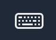

Use a physical keyboard.

 

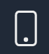

Use a touch screen keyboard.

 

# Manage devices

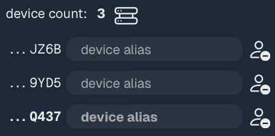

Next in the same game controls bar is the device count. Alongside it is a button to open the device manager, where you can remove/kick player devices from the game, including yourself.

The device ids are in the first column, then customizable aliases, and remove buttons.

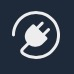

When your device is removed or loses connection, the reconnect/plug button appears near the end of the game controls bar. 
Tap it to rejoin/reconnect.

 

# Configure the game

## Set player count

Next in the game controls bar is the player count. This is separate from the device list because the number of people playing can be independent of the number of devices we’re using. Beep It does not yet use player count.

## Set board display mode

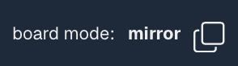

Board display mode controls whether the client devices each see the same widgets (**mirror**),

 

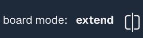

or different widgets (**extend**). In extend mode, widgets are evenly distributed among the different device screens.

 

## Set turn mode

The turn mode determines whether players take turns (competitive; not yet supported) or not (collaborative).

## Add widgets

Next in the game controls bar is the widget menu button; tap it to open the widgets drawer. 

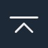

Tap it again to close.

 

This drawer is a view of all the types of widgets that are available to add to the board. See [widget types](#readme-widget-types) for an explanation of each. Each widget type in the drawer can be configured. Tap the widget control/icon to add it to the board (below drawer). 
Each widget instance can still be configured (with additional options) after addition to the board.

Tap the quick/random widget button to a add a randomized widget to the board.

 

### Configure widgets

| attribute | description |
| --- | --- |
| `label` | At the top of the widget card is a text input to name the widget. It can be left blank. When the game gives players a command, this `label` is the object. |
| `color` | Widgets all default to a white foreground; use the color picker to change this. |
| `size` | If widgets are overflowing the device screen viewport, use this slider to shrink the widget’s icon. |
| `duration` | Amount of extra time given for a player to do this widget. |
| `command text` | When the game gives players a command, `command` is the verb. |
| `command audio` | Record audio in the browser with the microphone button (may not work on some devices), or upload an audio file. This audio will be played when the corresponding command is given. |

## Preview board

To hide most widget config controls in the board, tap the preview button near the end of the game controls bar.

Tap it again to resume configuring widgets.

 

# Play the game

Tap the play button near the end of the game controls bar to begin.

The game will emit a command and wait for a player device to do the corresponding widget action. If the wrong widget is done, or none are done quickly enough, the game ends. If the right widget is done, then score increments and the next command is emitted.

 

<h1 id="readme-widget-types">Widget types</h1>

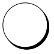

**Button**

Action is mouse click or tap.

 
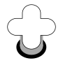

**Knob / Twist**

Action is to drag in a circle. Technically, the drag must pass through 3/4 quadrants.

 
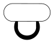

**Lever**

Action is to drag in the corresponding direction.

The configurable `direction` is one of four cardinal directions in which to pull it. 
Specify with the first letter of `U`p, `D`own, `L`eft, or `R`ight.

 
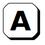

**Key**

Action is to press the corresponding keyboard key. This is only compatible with devices that have peripheral keyboards (generally not mobile).

The configurable `key` to press is case sensitive and should support any printable character, even if the physical source keyboard requires a combination of keys to press it.

 

**Wait**

Action is to do nothing.

 

**Path**

Action is to trace the single connected path, starting from either endpoint.

The configurable `path` to trace is in [`svg.path.d` string format](https://developer.mozilla.org/en-US/docs/Web/SVG/Reference/Attribute/d). Define it by dragging in the widget's control graphic area. The text input provides access to manually edit the control points. Their coordinates are expressed in the icon's source viewport space (90x90).

 
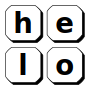

**Keypad**

Action is to type a key combination/phrase, configurable with `text`. As with **key**, this is only compatible with devices that have peripheral keyboards (generally not mobile).